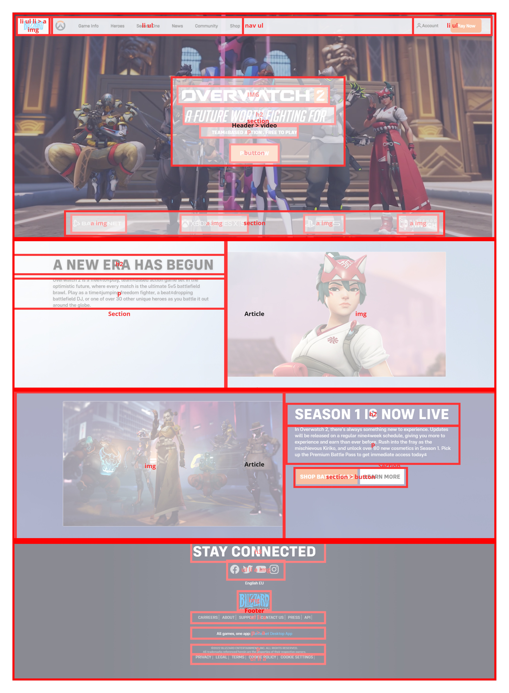
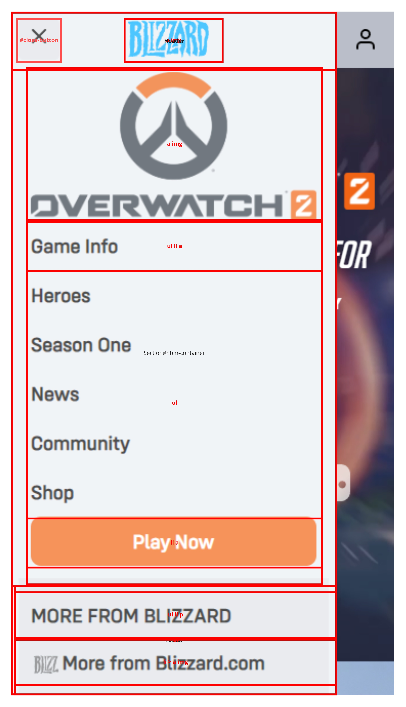
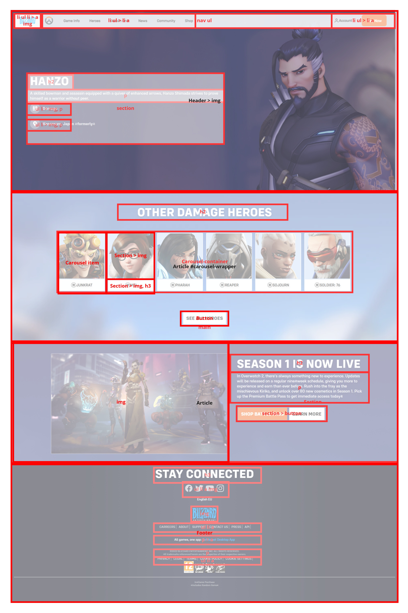
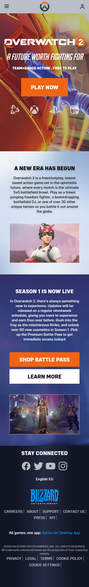
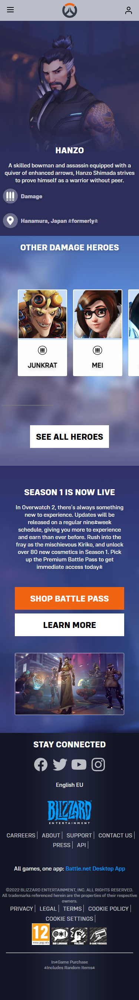
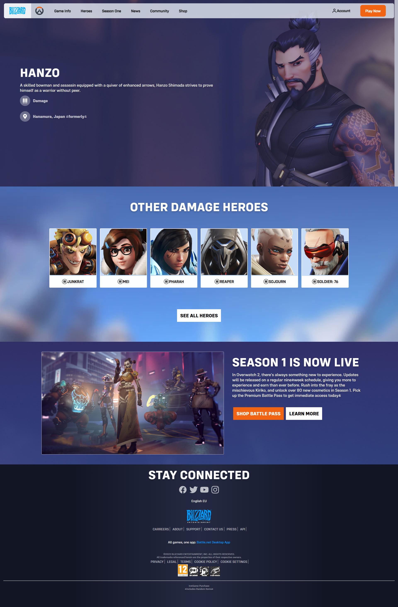
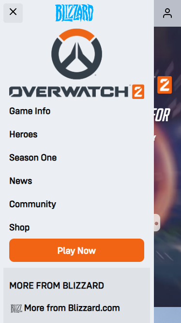
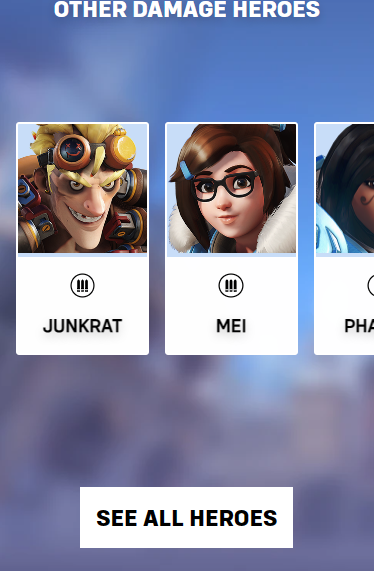

# Procesverslag
Markdown is een simpele manier om HTML te schrijven.  
Markdown cheat cheet: [Hulp bij het schrijven van Markdown](https://githucom/adam-p/markdown-here/wiki/Markdown-Cheatsheetb.).

Nb. De standaardstructuur en de spartaanse opmaak van de README.md zijn helemaal prima. Het gaat om de inhoud van je procesverslag. Besteedt de tijd voor pracht en praal aan je website.

Nb. Door *open* toe te voegen aan een *details* element kun je deze standaard open zetten. Fijn om dat steeds voor de relevante stuk(ken) te doen.

## Jij

  
uitwerken voor kick-off werkgroep

  ### Auteur:
  Emre Taskopru

  #### Je startniveau:
  Rode/Zwarte piste

  #### Je focus:
  Responsive
 

## Je website

  
uitwerken voor kick-off werkgroep

  ### Je opdracht:
  https://overwatch.blizzard.com/en-gb/ 

  #### Screenshot(s) van de eerste pagina (small screen): 
  Overview pagina 
  

  #### Screenshot(s) van de tweede pagina (small screen):
  News pagina 
  
  
 

## Toegankelijkheidstest 1/2 (week 1)

  
uitwerken na test in 1e werkgroep

  ### Bevindingen
  Lijst met je bevindingen die in de test naar voren kwamen:
  - Je kan op de site door alle interactieve elementen tabben
  - De screenreader begint met lezen in de footer? (screenreader in microsoft edge browser)

  #### Screenreader
  Hier korte omschrijving (met indien nodig afbeeldingen)
  - De screenreader begint met lezen in de footer inplaats van begin van de pagina waar je het verwacht. (screenreader van de browser Microsoft Edge)
  - Met Windows narrator worden de interactieve elementen erg goed beschreven maar is het moeilijk om te navigeren naar de stukken tekst.

  Hier een omschrijving van hoe het opgelost kan worden (met indien nodig afbeeldingen)
  - Door ook te kunnen tabben naar de headers en alinea's.

  #### Muis en Toetsenbord 
  Hier korte omschrijving (met indien nodig afbeeldingen)
  - Werkt zoals verwacht maar met screenreader aan is het onduidelijk hoe je de broodtekst laat lezen. Het leest met veel moeite 1 zin.
  Hier een omschrijving van hoe het opgelost kan worden (met indien nodig afbeeldingen)
  - Naar de broodtekst kunnen navigeren met tab alsof het een interactieve element is.

  #### Motoriek (shocks, elastiekjes)
  Hier korte omschrijving (met indien nodig afbeeldingen)
  Dit was niet van toepassing in de eerste week
  Hier een omschrijving van hoe het opgelost kan worden (met indien nodig afbeeldingen)
  N.v.t. in de eerste week

  #### Visueel (brillen, contrast, kleurenblind, dark/light). 
  Hier korte omschrijving (met indien nodig afbeeldingen)
  - Grotendeels niet van toepassing in de eerste week. Geen gebruik van dark/light mode en ook niet specifiek rekening gehouden met slechtzienden

  Hier een omschrijving van hoe het opgelost kan worden (met indien nodig afbeeldingen)
  n.v.t.

## Breakdownschets (week 1)

  
uitwerken na afloop 2e werkgroep

  ### Pagina 1: 
  

  ### Hamburger menu: 
  

  ### Pagina 2 - inclusief carousel: 
  

## Voortgang 1 (week 2)

  
uitwerken voor 1e voortgang

  ### Stand van zaken
  Voor de eerste voortgang gesprek had ik mijn eerste pagina grotendeels af. Een mobile en desktop navigatie bar gemaakt en ook helemaal reponsive gemaakt. Ik hb alleen moeite gehad met het importeren van de custom font die door de originele site werd gebruikt.

  ### Agenda voor meeting
  Hulp vragen met het importeren van custom font.

  ### Verslag van meeting
  Hulp gevraagd en gekregen met het toevoegen van custom fonts in me website.
  Ik wist dat je het moest toeveogen met @font-face maar wist niet precies hoe je de font
  hoort aan te spreken omdat het veel verschillende varianten had. De student assisstent heeft
  me hierin geholpen door 1 file specifiek aan te spreken en in css hier varianten mee te maken.

  - Font-face custom font toegevoegd
  - 1 font variant gekozen
  - Verschillende font varianten gemaakt met css (italic, bold, etc.)

## Voortgang 2 (week 3)

  
uitwerken voor 2e voortgang

  ### Stand van zaken
  Ik loop al best wel lang vast met het maken van een carousel. Als eerst wou ik dit gaan doen met CSS omdat dat me makkelijk leek. Maar ik had nog niks met javascript gedaan dus ging ik daar eerst desk-research voor doen. Dit bleek een beetje ingewikkeld en onnodig omdat ik libraries moest gebruiken dus heb ik het alsnog met CSS flexbox proberen te doen. Dit duurde 2 tot 3 dagen en was uiteindelijk 10 minuten voor de voortgangsgesprek gelukt.

  ### Agenda voor meeting
  Omdat de carousel die ik 2/3 dagen probeerde te maken net 10 minuten voor de voortgangsgesprek was gelukt had ik niet veel om te vragen. Ik heb vooral hulp gevraagd over bepaalde elementen en of deze semantisch correct zijn.

  ### Verslag van meeting
  Ik had vrijweinig te doen deze voortgangsgesprek omdat ik de carousel net voor de les had gefixt na 2 dagen er aan te werken. Ik heb aantal CSS problemen opgelost.

  - Carousel werkend
  - Font CSS van de originele site na gemaakt
  - overal em veranderd naar rem in de CSS omdat het voor problemen zorgde na het veranderen van de 
    font grootte.
- ...

## Toegankelijkheidstest 2/2 (week 4/5)

  
uitwerken na test in 8e werkgroep

  vooral eigen site

  ### Bevindingen
  Lijst met je bevindingen die in de test naar voren kwamen (geef ook aan wat er verbeterd is):
  - kleine tekst is moeilijk lezen wanneer je hand trilt door parkinsons (vooral dingen buiten de site)
  - 

  #### Screenreader
  Hier korte omschrijving (met indien nodig afbeeldingen)
  - Het begint met lezen onder de header
  - De alt tekst van interactieve elementen worden voorgelezen waardoor het duidelijkheid geeft over wat focussed is.
  - Op pagina 2 wordt bij de carousel items niet voorgelezen wat er geselecteerd is.

  Hier een omschrijving van hoe het opgelost kan worden (met indien nodig afbeeldingen)
  - Dit kan opgelost worden door de header in de main te zetten inplaats van er buiten.
  - De carousel items kunnen opgelezen worden door er handmatig een uitleg bij te zetten

  #### Muis en Toetsenbord 
  Hier korte omschrijving (met indien nodig afbeeldingen)
  - Makkelijk te navigeren naar alle interactieve elementen. Kan niet tabben naar broodtekst om dat hardop te laten voorlezen
  - De header wordt overgeslagen omdat het niet in de main zit

  Hier een omschrijving van hoe het opgelost kan worden (met indien nodig afbeeldingen)
  - Header in main zetten
  - Broodtekst focusable maken

  #### Motoriek (shocks, elastiekjes)
  Hier korte omschrijving (met indien nodig afbeeldingen)
  - Telefoon gebruik en navigatie is moeilijk omdat je geen goede controle hebt over je de "gestures". Ook tik je makkelijker bepaalde items peronguluk aan omdat je vinger door het trillen tegen je scherm kan aan komt wanneer je dat niet wilt.

  Hier een omschrijving van hoe het opgelost kan worden (met indien nodig afbeeldingen)
  - Je kan accidental touches oplossen door de interactie van interactieve elementen te veranderen naar longpress of double click.

  #### Visueel (brillen, contrast, kleurenblind, dark/light). 
  Hier korte omschrijving (met indien nodig afbeeldingen)
  - Het is in het algemeen nog redelijk goed te gebruiken. Het kost alleen meer moeite voor de gebruiker omdat hij meer moet inspanning moet gebruiken en meer moet focussen.

  Hier een omschrijving van hoe het opgelost kan worden (met indien nodig afbeeldingen)
  - Er is niet veel verandering nodig op de site. Indien nodig kan je hoger conrast of kleurenblind modus hebben op de site.

## Voortgang 3 (week 4)

  
uitwerken voor 3e voortgang

  ### Stand van zaken
  Ik heb eerst mijn eigen hamburger menu proberen te maken met eigen javascript. Dit werkte maar de manier waar op ik het had gedaan was het niet mogelijk om transities/animatie toe te voegen aan de hamburger menu. Ik had heel lang gezocht naar de hamburger menu opdracht maar kon dit niet vinden omdat het alleen te zien was op kleine scherm. De docent heeft me geholpen met het vinden van de opdracht en heb ik vervolgens dit op mijn eigen manier toegevoegd aan mijn website.

  ### Agenda voor meeting
  Vragen over responsiveness images die veranderen op groter scherm en semantiek over label in de footer. Vragen over of het nodig is om een tweede media querie te maken voor tussen mobile en desktop.
  

  ### Verslag van meeting
  Vooral zelfstandig werken aan de read.me door terug te kijken in mijn github desktop commits.

  - Bewerkte website screenshots toevoegen aan de read-me.
  - Breakdown schets opnieuw maken.
  - Docent vragen over responsiveness.
  - Docent vragen over label semantiek in de footer.

## Eindgesprek (week 5)

  
uitwerken voor eindgesprek

  ### Je uitkomst - karakteristiek screenshots:
  
  

  
  

  ### Dit ging goed/Heb ik geleerd: 
  Korte omschrijving met plaatjes
  - Ik had de site al in de eerste 2 weken grotendeels af.
  - Layout maken ging heel makkelijk met flexbox omdat ik al ervaring heb.
  - Ben geen errors opgelopen buiten 1 van mijn itteraties waarin ik ging experimenteren met 3 ul's in 1 navigatie bar.

  - Geleerd hoe je flexbox kan manipuleren op nog ingewikkeldere manieren om interactie na te bootsen (carousel).
  - Aantal CSS tricks geleerd.
  - Geleerd hoe je slide-in animatie maakt d.m.v. javascript en css (hamburger menu).
  - Veel toegankelijkheids kennis opgedaan en best practices geleerd.
  - Skip to main link
  

  ### Dit was lastig/Is niet gelukt:
  Korte omschrijving met plaatjes
  - Het was heel erg moeilijk om een slideshow/carousel te maken met flexbox maar uiteindelijk gelukt.
  - Het was moeilijk om de flexbox carousel responsive te maken en werkend te houden.
  - Heel veel tijd besteed aan de navigaties op 1 of ander manier. Ik had grotendeels van de website al in de eerste 2 weken maar heb vervolgens in de komende weken heel veel gewerkt aan de navigatie menu's en hier meerdere malen op geittereerd.
  - het was erg irritant, koste veel tijd en maakte de css erg chaotisch en slordig doordat we elementen erg specifiek moesten aanspreken iedere keer en door specifiek aanspreken van elementen sommige css voorrang kreeg over anderen en vervolgens weer dubbel geschreven moesten worden om te overwriten. Vooral omdat we geen "class sets" konden maken moest ik iedere keer images, anchors, buttons, paragrafen, headers, icons, en etc volledig opnieuw aanspreken en stylen.
  - uiteindelijk is alles gelukt. Als ik meer tijd had zou ik alles pixel perfect uitwerken, toegankelijkheid drastisch verbeteren en een extra media query toevoegen voor betere responsiveness. Ik heb doordat ik deze dingen wou doen (perfectionisme) dus andere dingen niet afgekregen, het is niet realistisch om dat allemaal in zo weinig tijd te doen.
  

  - Ook wil ik even aangeven dat de site is veranderd. Er is in de navigatie search functie toegevoegd, de main pagina content is veranderd en tekst in de header van pagina 2 is veranderd. Ik heb voor een aantal dingen waybackmachine van archive.org gebruikt om te kijken naar archived snapshots van de vorige versie. Maar deze is alleen deels beschikbaar.

## Bronnenlijst

  
continu bijhouden terwijl je werkt

  1. Bron hamburger menu javascript; https://codepen.io/shooft/pen/GRxXboQ 
  2. Bron Hamburger menu CSS flex:1; fix (bron kwijt)
  3. Bron skip to main en toegankelijkheid kennis https://webdesign.tutsplus.com/articles/keyboard-accessibility-tips-using-html-and-css--cms-31966

